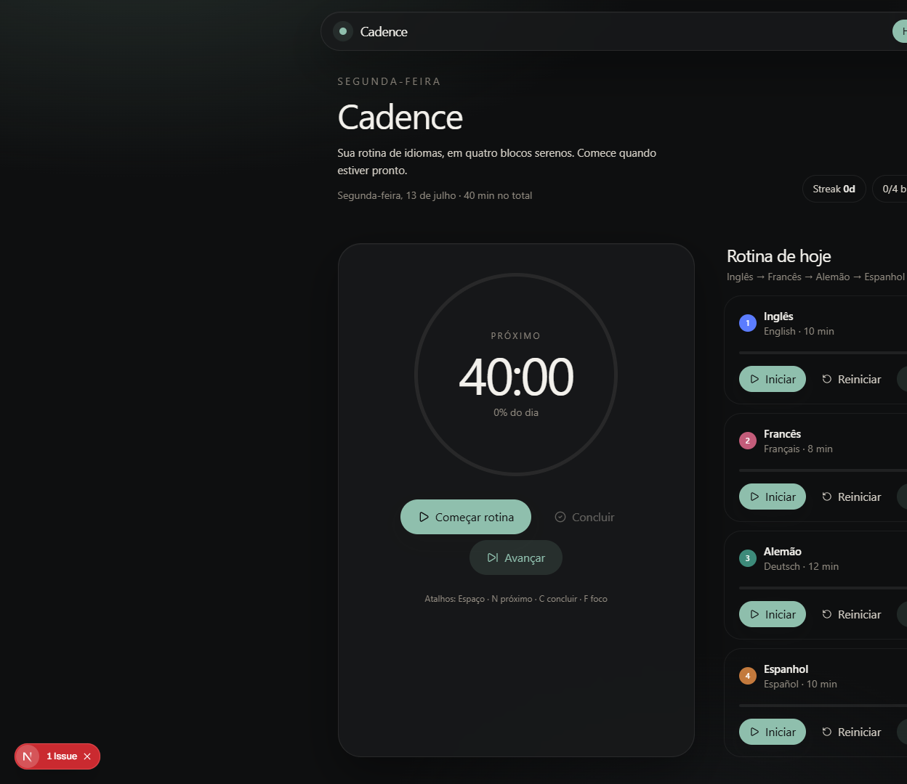
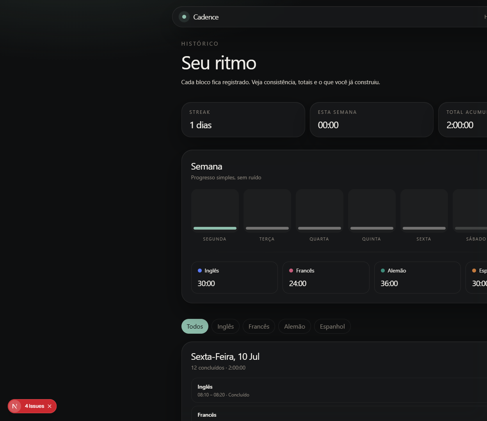
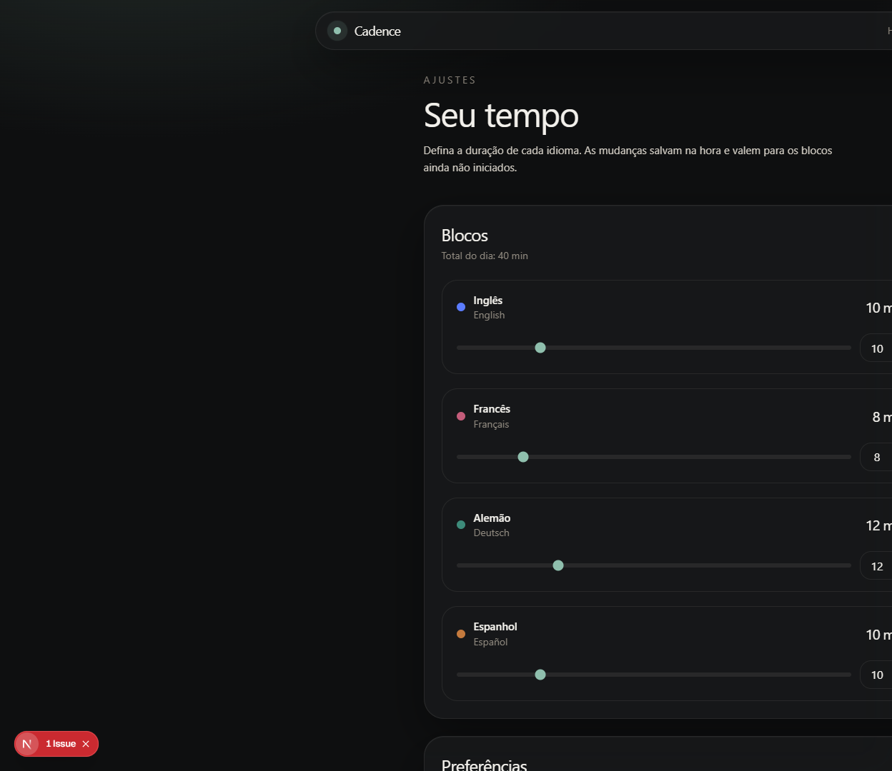

# Cadence

**Local-first companion for a weekday language-study routine.**

Cadence helps you run a fixed four-block habit — English → French → German → Spanish — with timers, focus mode, and a simple history. It is a **lab / side project** for product taste and client-side domain modeling, not a data platform and not the center of a data-engineering portfolio.

**Live demo (canonical):** https://cadence-ecru-three.vercel.app

<p align="center">
  
</p>

---

## Problem & audience

Studying multiple languages on tools like Duolingo is easy to start and easy to abandon mid-sequence. Cadence is for a single person who wants a calm coach for **order, duration, and consistency** — without accounts or dashboards.

## Solution & flow

1. Open **Hoje** and see today’s four blocks  
2. Start / pause / resume / complete each language  
3. Optionally use **Foco** and keyboard shortcuts  
4. Review **Histórico** (streak, weekly bars, totals)  
5. Tune durations in **Ajustes**  

Data stays in the browser (`localStorage`). No login.

---

## What this project demonstrates

- Product restraint and visual hierarchy for a habit loop  
- Client-side session machine (timers + history status rules)  
- Local-first persistence with sanitization and throttled writes  
- DX: Vitest, ESLint, typecheck, GitHub Actions, honest docs  

**What it does *not* claim:** analytics engineering, ML, multi-tenant SaaS, or enterprise readiness.

---

## Features

- Ordered EN → FR → DE → ES blocks with configurable minutes  
- Timers: start, pause, continue, reset, manual complete, next  
- Focus mode + optional completion chime  
- History by day / language, streak (weekdays), weekly chart  
- First-visit tip, loading skeleton, confirm before clearing history  
- Demo seed in Settings (for screenshots / interview demos)  

---

## Architecture

```text
UI (Next.js App Router)
  → Zustand store (session orchestration)
    → domain helpers (pure rules)
    → localStorage (`cadence.v1`, sanitized)
```

Details: [`docs/ARCHITECTURE.md`](./docs/ARCHITECTURE.md) · decisions: [`docs/TECHNICAL_DECISIONS.md`](./docs/TECHNICAL_DECISIONS.md)

### Stack

Next.js 15 · React 19 · TypeScript · Tailwind CSS 4 · Framer Motion · Zustand · Vitest · GitHub Actions · Vercel

---

## Quick start

```bash
pnpm install
pnpm dev
```

Open http://localhost:3000 — no env vars required ([`.env.example`](./.env.example)).

### Quality gates

```bash
pnpm lint
pnpm typecheck
pnpm test
pnpm build
```

---

## Screenshots

| Today | History | Settings |
| --- | --- | --- |
|  |  |  |

Capture notes: [`docs/screenshots/README.md`](./docs/screenshots/README.md)

---

## Demo script (≈4 minutes)

1. Open the live demo → dismiss onboarding if shown  
2. Start English → pause → resume (Space)  
3. Complete a block manually (C) → advance (N)  
4. Toggle focus (F)  
5. Open History → explain streak / empty week vs totals  
6. Settings → change a duration → optionally load demo history  

Full script: [`docs/DEMO_SCRIPT.md`](./docs/DEMO_SCRIPT.md)

---

## Status & limitations

| Item | Reality |
| --- | --- |
| Role | **Laboratory / side project** (not home featured) |
| Deploy | Public Vercel demo live |
| Sync | None — single browser / origin |
| Auth | None |
| Timer drift | Possible when the tab is backgrounded |
| Manual complete @ 0 elapsed | Credits planned duration (intentional check-off) |

Quality-pass is deployed to the canonical URL under the `baruja-fe` Vercel team. Prefer this URL over older aliases on other accounts.

---

## Interview talking points

> “Cadence is a personal habit tool. The interesting part is the session state machine, weekday streak semantics, and keeping the timer interval stable while persisting safely. I kept it local-first on purpose so the product stays instant — and so it doesn’t pretend to be a data platform.”

---

## Docs

| Doc | Purpose |
| --- | --- |
| [`docs/PORTFOLIO_HANDOFF.md`](./docs/PORTFOLIO_HANDOFF.md) | Portfolio consolidation |
| [`docs/AUDIT_REPORT.md`](./docs/AUDIT_REPORT.md) | Audit |
| [`docs/HANDOFF.md`](./docs/HANDOFF.md) | Engineering handoff |
| [`docs/DEPLOYMENT.md`](./docs/DEPLOYMENT.md) | Deploy |
| [`docs/SECURITY_NOTES.md`](./docs/SECURITY_NOTES.md) | Privacy |

## License

Personal / portfolio use.
